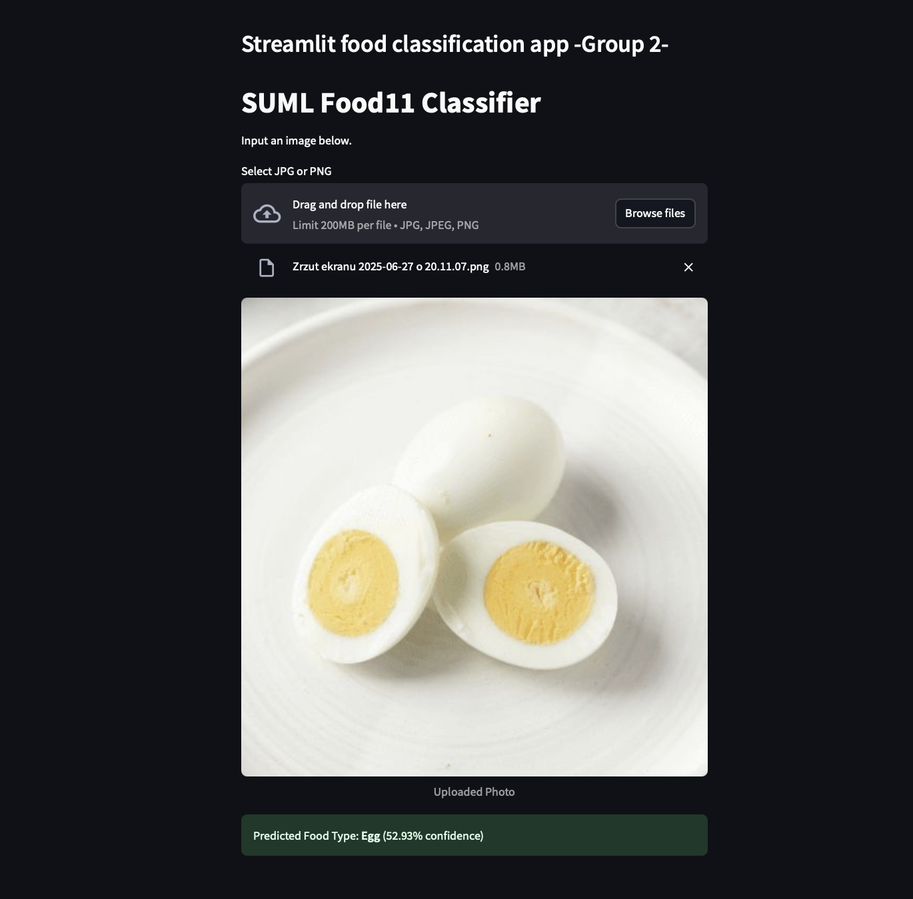

# Projekt ML: Klasyfikacja obrazów jedzenia (ONNX + Streamlit + MLflow)

Ten projekt to kompletny pipeline uczenia maszynowego oparty na ONNX, MLflow, Streamlit i Gradio. Obejmuje trening modeli, śledzenie eksperymentów, wersjonowanie, rejestrację modeli oraz wdrożenie aplikacji do klasyfikacji zdjęć potraw.

---

## Cele projektu

- Trenowanie modelu klasyfikującego zdjęcia potraw (dataset Food11)
- Konwersja modelu do formatu ONNX i PTH
- Utworzenie aplikacji webowej (Gradio, Streamlit)
- Wdrożenie modelu z wykorzystaniem MLflow Model Registry
- Rejestracja i monitorowanie eksperymentów ML
- Automatyzacja procesu przez GitHub Actions
- Zbudowanie środowiska uruchomieniowego za pomocą Dockera

---

## Jak uruchomić projekt lokalnie

### 1. Utwórz środowisko i zainstaluj zależności

```bash
python3 -m venv .venv
source .venv/bin/activate
pip install -r requirements.txt
```

### 2. Uruchom serwer MLflow

```bash
mlflow server --host 127.0.0.1 --port 8080
```

### 3. Zarejestruj model ONNX

```bash
python register_model.py
```

Zarejestrowany model będzie widoczny pod adresem: http://localhost:8080/#/models/Food11ONNX

---

## Uruchamianie aplikacji

### ▶ Streamlit (klasyfikacja zdjęcia przez użytkownika)

```bash
streamlit run Streamlit/app.py
```

### ▶ Gradio (alternatywna wersja interfejsu)

```bash
python Gradio/app.py
```

---

## Uruchomienie w kontenerze Docker

### 1. Budowa kontenera

```bash
docker build -t streamlit-mlflow-app .
```

### 2. Uruchomienie aplikacji

```bash
docker run -p 8501:8501 -v $(pwd)/mlruns:/app/mlruns streamlit-mlflow-app
```

---

## Trening modelu

Skrypt `train.py` zapisuje model jako `.onnx`, `.pth` i `.skops` w katalogu `Model/outputs/`.

```bash
python Train/train.py
```

Model można później zarejestrować ręcznie lub automatycznie przez `register_model.py`.

---

## Technologie

- Python 3.10
- Streamlit
- Gradio
- ONNX + ONNXRuntime
- MLflow
- Docker
- GitHub Actions

---

## CI/CD

W katalogu `.github/workflows/` znajdują się definicje:
- `ci.yml` – testowanie kodu przy każdym commicie
- `cd.yml` – wdrożenie aplikacji

---

## Przykładowy rezultat

> 

---
